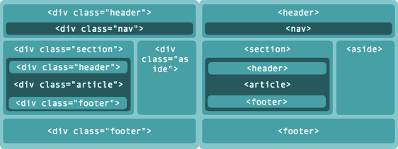

# HTML ❗
### 📇 [Volver al indice](./indice.md)
## Doctype
Se utiliza como declaración para indicarle al navegador qué version de html se utilizó para escribir el documento.  Para que los navegadores sepan con qué sintaxys y gramatica se utilizo y puedan comprobar su validez.
* 🌎 [Documentacion - MDN ](https://developer.mozilla.org/es/docs/Glossary/Doctype)
* 🌎 [Informacion extra de freecodecamp](https://www.freecodecamp.org/espanol/news/que-es-la-declaracion-en-html)

## HTML semantico
Es una caracteristica introducida en HTML5, son etiquetas que ayudan a definir la estructura de un sitio web de una forma en la que resulta mas legible para los humanos y las maquinas.
Se dice que son elementos semánticos porque el nombre de la etiqueta describe significativamente el tipo de contenido que contiene.
Por ejemplo la etiqueta < main >, (un documento solo puede tener una sola etiqueta < main >) dentro de ella se debe color el contenido principal de un sitio web.


### Listado de etiquetas semanticas
* < main > ➡️ Especifica el contenido principal de un documento
* < article > ➡️ Define un artículo
* < section > ➡️ Define una sección en un documento
* < nav > ➡️ 	Define enlaces de navegación
* < header > ➡️ Especifica un encabezado para un documento o sección
* < footer > ➡️ Define un pie de página para un documento o sección
* < aside > ➡️ Define el contenido aparte del contenido de la página
* < figure > ➡️ Especifica contenido autónomo como ilustraciones, diagramas, fotos, listados de códigos, etc.
* < figcaption > ➡️ Define un título para un elemento < figure >
* < details > ➡️ Define detalles adicionales que el usuario puede ver u ocultar
* < summary > ➡️ Define un encabezado visible para un elemento < details >
* < mark > ➡️ Define texto marcado / resaltado
### Ventajas de utilizar etiquetas semanticas
* el codigo se encuentra mejor estructurado y legible
* permite mejor accesibilidad
* mejora el posicionamiento web
### Maquetacion "antigua" vs Maquetacion con etiquetas semanticas

* 🌎 [Documentacion - MDN ](https://developer.mozilla.org/en-US/docs/Glossary/Semantics)
* 🌎 [Informacion extra de freecodecamp](https://www.freecodecamp.org/espanol/news/elementos-semanticos-html5-explicados/)

## Imagenes responsivas
```CSS
img {
  max-width: 100%;
  height: auto;
}
```
